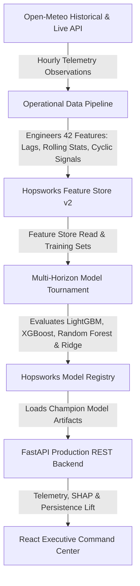

# PEARLS Air Quality Index (AQI) Predictor & MLOps System

[](https://www.python.org/)
[](https://www.hopsworks.ai/)
[](https://fastapi.tiangolo.com/)
[](https://reactjs.org/)

PEARLS is a multi-horizon atmospheric forecasting and MLOps platform engineered to predict Fine Particulate Matter ($\text{PM}_{2.5}$) and European Air Quality Index (AQI) levels across 24-hour (+24h), 48-hour (+48h), and 72-hour (+72h) lead times. 

The system operates on continuous hourly observation telemetry from the Open-Meteo API, synchronizes engineered feature sets to the Hopsworks Feature Store, executes automated multi-model estimator tournaments, and serves real-time predictions with SHAP feature explainability through a REST API and React command center dashboard.

---

## 🏛️ System Architecture

The architecture connects data ingestion, feature store synchronization, automated model tournaments, model registration, and real-time API serving.



---

## 📊 Model Tournament & Holdout Performance

The model tournament evaluates candidate estimators across individual forecast horizons (+24h, +48h, +72h) using chronological holdout validation on 2 full years (~17,520 hourly observations). Performance is benchmarked against naive persistence baselines.

### Evaluation Benchmarks

| Horizon | Champion Estimator | Holdout RMSE ($\mu g/m^3$) | Holdout MAE ($\mu g/m^3$) | Holdout $R^2$ | Naive Persistence RMSE | Persistence Lift (%) |
| :--- | :--- | :---: | :---: | :---: | :---: | :---: |
| **Day 1 (+24h)** | **LightGBM Regressor** | **11.07** | **8.36** | **0.4223** | 12.13 | **+8.76%** |
| **Day 2 (+48h)** | **XGBoost Regressor** | **13.26** | **10.28** | **0.1771** | 14.59 | **+9.08%** |
| **Day 3 (+72h)** | **Random Forest** | **13.74** | **10.80** | **0.1355** | 16.45 | **+16.51%** |
| **Overall (72h)** | **Multi-Horizon Ensemble** | **12.69** | **9.81** | **0.2450** | 14.39 | **+11.82%** |

---

## 🔬 Feature Engineering Strategy

The feature pipeline transforms raw atmospheric variables into 42 engineered predictive signals:

1. **Autoregressive Lags & Rolling Statistics**:
   - $\text{PM}_{2.5}$ Lags: 1h, 2h, 3h, 6h, 12h, 24h, 48h, 72h.
   - Aggregations: 6-hour, 12-hour, 24-hour, and 48-hour rolling means, standard deviations, minima, maxima, and exponential moving averages (EMA).
2. **Cyclical Temporal Encoding**:
   - Sine/Cosine transformations of Hour-of-Day ($\sin(2\pi \cdot h/24), \cos(2\pi \cdot h/24)$) and Day-of-Year.
3. **Atmospheric Dispersion & Thermal Inversion Proxies**:
   - Interaction between surface pressure ($\text{hPa}$) and relative humidity ($\%$) to signal potential thermal inversion layers.
   - Boundary layer dispersion indices computed from 10m wind speed observations.
4. **Target Variance Stabilization**:
   - Models utilize $\log(1 + y)$ target transformation (`TransformedTargetRegressor`) to stabilize variance during acute air pollution spikes.

---

## 🛠️ Tech Stack

- **Machine Learning**: LightGBM, XGBoost, Scikit-Learn, SHAP
- **Feature Store & Registry**: Hopsworks Feature Store v2 & Model Registry
- **Backend API**: FastAPI, Uvicorn, Pydantic v2
- **Frontend Dashboard**: React 18, Vite, Tailwind CSS, Recharts, Framer Motion
- **Automation & CI/CD**: GitHub Actions

---

## 🚀 Getting Started

### 1. Prerequisites
- Python 3.10+
- Node.js 18+ and npm

### 2. Setup & Environment

Clone the repository and install backend dependencies:

```bash
git clone https://github.com/your-username/pearls-aqi-predictor.git
cd pearls-aqi-predictor

# Create virtual environment
python -m venv venv

# Activate environment (Windows)
.\venv\Scripts\activate

# Activate environment (Linux/macOS)
source venv/bin/activate

# Install dependencies
pip install -r requirements.txt
```

Create a `.env` file in the root directory (refer to `.env.example`):

```ini
HOPSWORKS_API_KEY=your_hopsworks_api_key_here
HOPSWORKS_PROJECT=pearls_aqi
LOCATION_LATITUDE=31.5204
LOCATION_LONGITUDE=74.3587
LOCATION_NAME=Lahore
STATION_NAME=Central_Observation_Point
```

---

## 💻 Pipeline Execution Commands

### Ingest Historical Observations (Backfill)
```bash
python src/backfill.py --days 730
```

### Run Hourly Feature Pipeline
```bash
python src/feature_pipeline.py
```

### Execute Model Tournament & Registration
```bash
python src/train_model.py
```

### Start FastAPI Backend Service
```bash
uvicorn src.api:app --host 0.0.0.0 --port 8000 --reload
```

### Start React Dashboard (Frontend)
```bash
cd client
npm install
npm run dev
```

---

## 📡 REST API Reference

| Method | Endpoint | Description |
| :--- | :--- | :--- |
| `GET` | `/api/telemetry` | Returns real-time forecasts, current weather, SHAP values, and persistence metrics. |
| `GET` | `/api/eda` | Serves statistical summaries, feature correlation matrices, and diurnal profiles. |
| `GET` | `/api/tournament` | Returns model tournament evaluation metrics and baseline lift matrix. |
| `POST` | `/api/subscribe` | Registers subscriber email for hazardous AQI threshold notifications. |
| `POST` | `/api/unsubscribe` | Removes subscriber email from notification dispatches. |

---

## ⚙️ Automated GitHub Actions Workflows

- **Hourly Feature Pipeline (`.github/workflows/feature_pipeline.yml`)**: Runs hourly (`cron: 0 * * * *`) to fetch fresh Open-Meteo telemetry and update the Hopsworks Feature Store.
- **Daily Model Retraining (`.github/workflows/training_pipeline.yml`)**: Runs daily (`cron: 0 2 * * *`) to evaluate candidate models, test promotion gates, and update champion models in the Hopsworks Registry.
